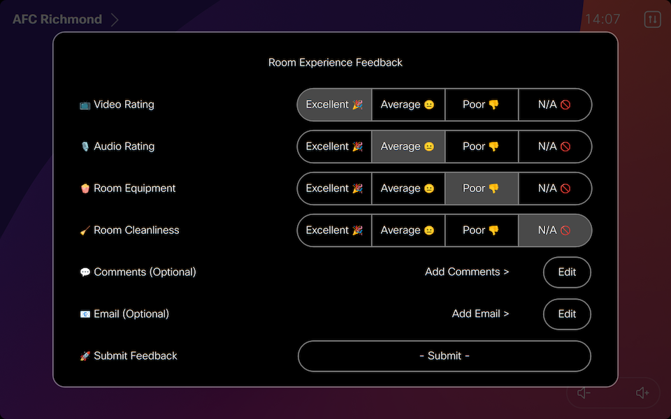

# wi-room-experience

## Room Experience Workspace Integration

 

Room Experience is designed to gather user feedback using a survey displayed either at end of a call or initiated using a feedback button in the UI.

Captured data can be sent to the following destinations
- Webex Messaging Space
- MS Teams 'Team' Channel
- HTTP Server (such as Power Bi)
- Service Now

An overall rating is calculated based on the lowest value of the four selections, if N/A is selected, this entry is not used in the calculation. The overall rating is used to determine what happens when the result is submitted / survey times out (if enabled). The table below provides an explanation of how enabled services are processed.

Separate Webex Messaging spaces can be defined for Feedback vs Call Survey messages.

This solution is available as a Workspace Integration (coming soon) as well as a standalone Macro.

### Integration Notes

- Periodic checks for newly tagged devices occurs at half hourly intervals.
- A local JSON file is kept as a cache of devices provisioned for this Workspace Integration. This aims to ensure that if a device is untagged, any artifacts (buttons, panels, macros) will be removed from the device even if the integration be restarted. 
- To mitigate delays in UI interactivity, the WI version optionally supports the deployment of a companion macro to locally handle dialog changes whilst the remote server processing the data provided.

### Macro Version

Within the macro directory of this repository contains a macro version of this for individual device deployment, if preferred. As the underlying code is shared between both the macro and the Workspace Integration, it will be maintained in the same repository for consistency.



### Service Processing

The following table outlines how responses are processed for enabled services

| Service | Rating | Requirements
| ---- | ---- | ----
| Webex | Any* | Message will be sent if Survey contains Comments
| Webex | Excellent |  Message will be sent if `RE_WEBEX_LOG_EXCELLENT` is enabled
| Webex | Average/Poor | Message will be sent
| MS Teams | Any* | Message will be sent if Survey contains Comments
| MS Teams | Excellent |  Message will be sent if `RE_TEAMS_LOG_EXCELLENT` is enabled
| MS Teams | Average/Poor | Message will be sent
| Service Now | Excellent | No Ticket will be raised
| Service Now | Average | Ticket is raised if `RE_SNOW_RAISE_AVERAGE` is enabled
| Service Now | Poor | Ticket will be raised
| HTTP Server | Any | Output will always be sent to the HTTP Server

## Prerequisites

The following items are needed, depending on the enabled services.

**Workspace Integration**
1. Navigate to Workspace Integrations in [Control Hub](https://admin.webex.com/workspaces/integrations)
2. Select `Add integration` then `Upload integration` and provide included manifest.json file - ensure you document the provided credentials
3. Navigate to the newly created Integration and select `Activate` from the `Actions` menu - ensure you document the encoded activation code
3. Add the required Device Tag (default: `wi-room-experience`) to each device to be managed by this integration

**Webex Spaces**
- A Webex Bot - create at [developer.webex.com](https://developer.webex.com/my-apps/new/bot) 
- One or two new or existing Webex Spaces with the Webex bot as a member.
- Defining `RE_WEBEX_FEEDBACK_ID` with a Room Id will send Feedback messages (from the Feedback button) to this separate space from Call Survey responses
- The RoomId of the destination Webex space. These example methods can be used to get the Room Id
  - Using the [List Rooms](https://developer.webex.com/docs/api/v1/rooms/list-rooms) Developer API
  - Adding `astronaut@webex.bot` to the space (bot will leave and 1:1 you the Id)

**MS Teams Channels**
- One or Two MS Teams 'Team' Channels configured with an [Incoming Webhook](https://learn.microsoft.com/en-us/microsoftteams/platform/webhooks-and-connectors/how-to/add-incoming-webhook?#create-an-incoming-webhook)
- Defining `RE_TEAMS_FEEDBACK_WEBHOOK` with a Webhook URL will send Feedback messages (from the Feedback button) to this separate channel from Call Survey responses
- Copy the Webhook URLs

**Service Now**
- A User account with the `sn_incident_write` permission
- The URL of your Service Now instance
- Credentials for the above user account, encoded in Base64 in the following format `username:password`
- Solution optionally supports searching CMDB using Serial Number to match CI Entity
- Extra Parameters (such as Assignment group) can also be passed to Service Now

**HTTP JSON**
- A remote service capable of receiving HTTP POST messages, including Power BI Streaming Dataset.
- The following format is used for the JSON Message
  ```
  {"timestamp":1707976373582,"system":"AFC Richmond","serial":"FOC12345678","version":"ce11.14.0.25.bcdec22c604","source":"call","rating":2,"rating_fmt":"Average","destination":"spark:123456789@webex.com","type":"webex","type_fmt":"Webex","duration":0,"duration_fmt":"","cause":"LocalDisconnect","video":1,"video_fmt":"Excellent","audio":1,"audio_fmt":"Excellent","equipment":1,"equipment_fmt":"Excellent","cleanliness":2,"cleanliness_fmt":"Average","comments":"","email":"","voluntary":1}
  ```

  - **Power BI:** Ensure you set `RE_HTTP_FORMAT=powerBi` to ensure it is correctly formatted. The required fields in a streaming dataset are outlined below.
  - **Loki:** Ensure you set `RE_HTTP_FORMAT=loki` to ensure it is correctly formatted. The App name used in Loki will match `APP_NAME`

## Deployment (Local)

1. Clone / Download repository
2. Run `npm install` to add the require dependencies (ensure Node and NPM are installed)
3. Rename `sample.env` to `.env` file and update the environment variables outlined below.
- Recommend adding `WI_LOGGING=info`, `CONSOLE_LEVEL=debug`, `RE_DEBUG_BUTTONS=true` and `LOG_DETAILED=true` during initial testing
4. Create a directory called `cache` which is used to store a listing of device instances to allow cleanup to occur
4. Start the integration using `npm run start`
5. Review the console logs to confirm no errors encountered

## Deployment (Docker)

The simplest deployment method is using [Docker](https://docs.docker.com/engine/install/) and [Docker Compose](https://docs.docker.com/compose/install/)

1. Clone / Download repository
   - Only sample.env and docker-compose.yml are needed if using prebuilt docker image
2. Rename `sample.env` to `.env` file and update the environment variables outlined below.
3. - Use the prebuilt image available on Docker Hub (default in docker-compose.yml)
   - Build local image - Uncomment build and comment image lines in docker-compose.yml
4. Provision and start the Integration using `docker-compose up -d`
5. Review the console logs using `docker logs wi-room-experience -f` (assuming you are using the default container name)

## Environmental / Macro Variables

These variables can be individually defined in Docker, loaded as an `.env` file in the app directory, or set in the top of the Macro.

**Note:** You must either include the encoded Activation Code, or the four individual decoded parameters.

| Name | Required | Type | Default | Description
| ---- | ---- | ---- | ------- | -----------
| **Integration Settings**
| APP_NAME | no | string | `wi-room-experience` | App Name
| CLIENT_ID | **Yes** | string | ` ` | Client Identifier provided during the Integration creation process
| CLIENT_SECRET | **Yes** | string | ` ` | Client Secret provided during the Integration creation process
| **---**
| CODE | no* | string | ` ` | Encoded Activation Code provided during the Integration activation process
| *-- or --*
| OAUTH_URL | no* | string | ` ` | Decoded oAuth URL from the Activation Code
| REFRESH_TOKEN | no* | string | ` ` | Decoded Refresh Token from the Activation Code
| WEBEXAPIS_BASE_URL | no* | string | ` ` | Decoded Webex APIs Base Url from the Activation Code
| APP_URL | no* | ` ` | string | Decoded App Url from the Activation Code
| **---**
| DEVICE_TAG | no | string | `wi-room-experience` | Device Tag used to determine which devices to process
| **Logging Settings**
| LOG_DETAILED | no | bool | `true` | Enable detailed logging
| LOG_UNKNOWN_RESPONSES | no | bool | `false` | Show unknown extension responses in the log (useful in debugging issues)
| CONSOLE_LEVEL | no | bool | `info` | Logging level exposed to console
| SYSLOG_ENABLED | no | bool | `false` | Enable external syslog server
| SYSLOG_HOST | no | string | `syslog` | Destination host for syslog server
| SYSLOG_PORT | no | num | `514` | Destination port for syslog server
| SYSLOG_PROTOCOL | no | str | `udp4` | Destination protocol for syslog server
| SYSLOG_SOURCE | no | str | `localhost` | Host to indicate that log messages are coming from
| LOKI_ENABLED | no | bool | `false` | Enable external Loki logging server
| LOKI_HOST| no | string | `http://loki:3100` | Destination host for Loki logging server
| **HTTP Proxy**
| GLOBAL_AGENT_HTTP_PROXY | no | string | ` ` | Container HTTP Proxy Server (format `http://<ip or fqdn>:<port>`)
| GLOBAL_AGENT_NO_PROXY | no | string | ` ` | Comma Separated List of excluded proxy domains (Supports wildcards)
| **Survey Panel**
| RE_PANEL_REMOVE | no | bool | `true` | Remove Panels prefixed with App Name not matching version ('wi-' is removed for panels/macros)
| RE_PANEL_EMOTICONS | no | bool | `true` | Show emoticons on the panel
| **Feedback Button**
| RE_FEEDBACK_ENABLED | no | bool | `true` | Include a report issue button on screen
| RE_FEEDBACK_COLOR | no | str | `#1170CF` | Color code of button
| RE_FEEDBACK_LOCATION | no | str | `HomeScreen` | Visible location of button (HomeScreen,HomeScreenAndCallControls,ControlPanel)
| **Companion Macro**
| RE_MACRO_LOCAL | no | bool | `true` | Use local companion macro for responsive UI interactions
| RE_MACRO_REMOVE | no | bool | `true` | Remove macro prefixed with App Name not matching version ('wi-' is removed for panels/macros)
| **Webex Messaging**
| RE_WEBEX_ENABLED | no | bool | `false` | Enable for Webex Space Message Logging
| RE_WEBEX_LOG_EXCELLENT | no | bool | `false` | Optionally log excellent results to Webex Space
| RE_WEBEX_BOT_TOKEN | no | str | `` | Webex Bot Token for sending messages
| RE_WEBEX_ROOM_ID | no | str | `` | Webex Room Id for sending messages
| RE_WEBEX_FEEDBACK_ID | no | str | `` | If defined, feedback messages will be sent here.
| **MS Teams Messaging**
| RE_TEAMS_ENABLED | no | bool | `false` | Send message to MS Teams channel when room released
| RE_TEAMS_LOG_EXCELLENT | no | bool | `false` | Optionally log excellent results to MS Teams channel
| RE_TEAMS_WEBHOOK | no | str | ` ` | URL for Teams Channel Incoming Webhook
| RE_TEAMS_FEEDBACK_WEBHOOK | no | str | `` | If defined, feedback messages will be sent here.
| **HTTP Server**
| RE_HTTP_ENABLED | no | bool | `false` | Enable for JSON HTTP POST Destination
| RE_HTTP_URL | no | str | `http://localhost:3000` | HTTP Server POST URL
| RE_HTTP_AUTH_ENABLED | no | bool | `false` | Destination requires HTTP Header for Authentication
| RE_HTTP_AUTH_HEADER | no | str | `Authorization: xxxxx` | Header Content for HTTP POST Authentication
| RE_HTTP_FORMAT | no | str | `none` | HTTP Custom Formatting - none,loki,powerBi
| **Service Now**
| RE_SNOW_ENABLED | no | bool | `false` | Enable for Service NOW Incident Raise
| RE_SNOW_RAISE_AVERAGE | no | bool | `true` | Raise SNOW Incident for Average Responses
| RE_SNOW_INSTANCE | no | str | `` | Specify the base url for Service Now
| RE_SNOW_CREDENTIALS | no | str | `` | Basic Auth format is "username:password" base64-encoded
| RE_SNOW_CALLED_ID | no | str | `` | Default Caller for Incidents, needs to be sys_id of Caller
| RE_SNOW_CMDB_CI | no | str | `` | Default CMDB CI, needs to be sys_id of CI
| RE_SNOW_CMDB_LOOKUP | no | bool | `false` | Lookup Device using Serial Number in Service Now
| RE_SNOW_EXTRA | no | json | `{}` | Any extra parameters to pass to Service Now
| **Global Settings**
| RE_DEVICE_JSON | no | str | `cache/devices.json` | Location of device cache JSON file
| RE_MIN_DURATION | no | num | `10` | Minimum call duration (seconds) before Survey is displayed
| RE_DEFAULT_SUBMIT | no | bool | `true` | Send result if not explicitly submitted (timeout event).
| RE_PROMPT_TITLE | no | str | `Room Experience Feedback` | Title shown on displayed prompts
| RE_DEBUG_BUTTONS | no | bool | `false` | Enables use of debugging Actions buttons designed for testing
| **Timeout Settings**
| RE_TIMEOUT_SURVEY | no | num | `20` | Timeout before initial survey panel is dismissed (seconds)
| RE_TIMEOUT_POPUP | no | num | `10` | Timeout before survey popups are dismissed (seconds)

### Power Bi Streaming Data Set

The following table outlines the fields required in a Power Bi API streaming dataset

| Value | Format
| ---- | ----
| timestamp | `DateTime`
| system | `String`
| serial | `String`
| version | `String`
| rating | `Number`
| source | `String`
| rating_fmt | `String`
| destination | `String`
| type | `String`
| type_fmt | `String`
| duration | `Number`
| duration_fmt | `String`
| cause | `String`
| video | `Number`
| video_fmt | `String`
| audio | `Number`
| audio_fmt | `String`
| equipment | `Number`
| equipment_fmt | `String`
| cleanliness | `Number`
| cleanliness_fmt | `String`
| comments | `String`
| email | `String`
| voluntary | `Number` (0: False 1: True)

## Support

In case you've found a bug, please [open an issue on GitHub](../../issues).

## Disclaimer

This application is provided as a sample only is NOT guaranteed to be bug free and production quality.
